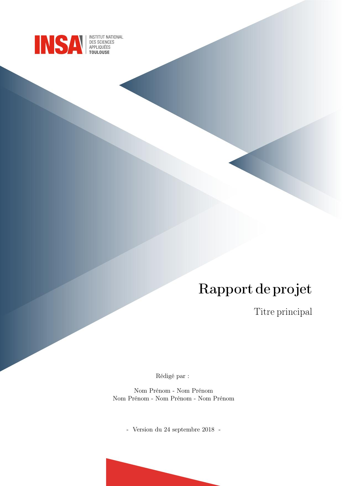
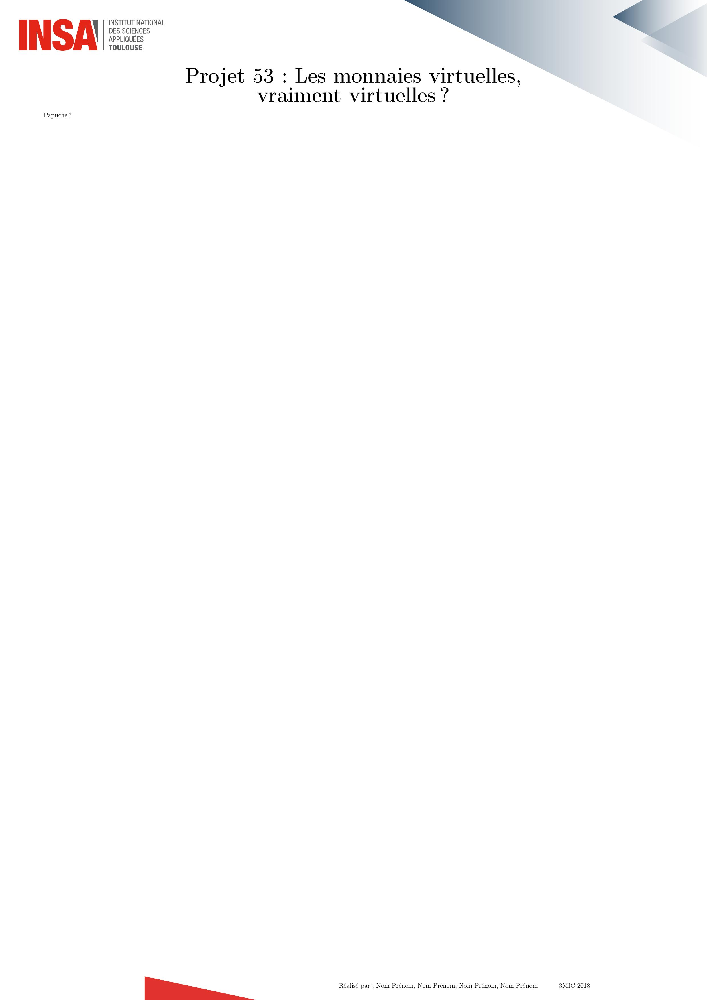
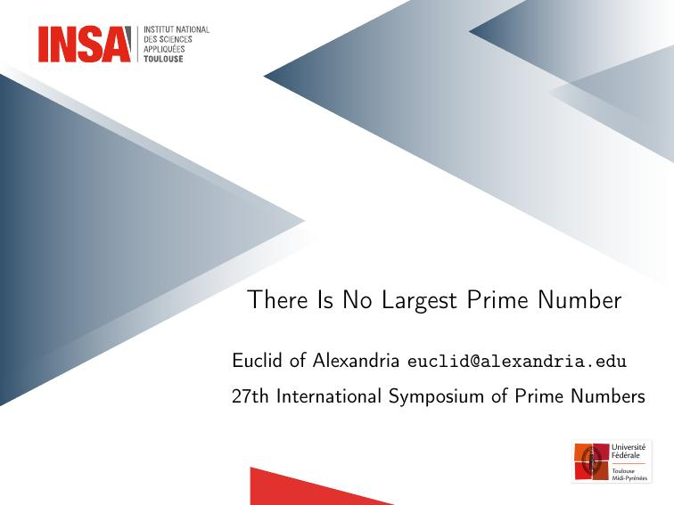
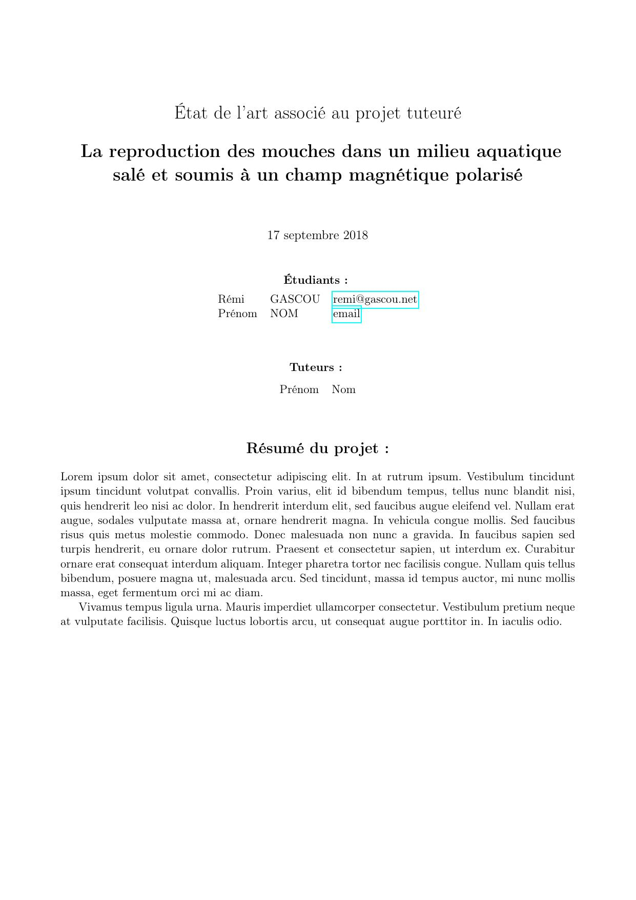

# LaTeX templates pour l'INSA de Toulouse

## Templates

### [-A] Charte graphique A4

La charte graphique de l'INSA de Toulouse, adaptée à des documents A4, avec une 1ère de couverture et une 4ème de couverture. 

| First page | Last page |
|-|-|
|  |  |

### [-A] Charte graphique poster A2

La charte graphique de l'INSA de Toulouse, adaptée aux posters A2.

| First page | Last page |
|-|-|
|  |  |

### [-A] Charte graphique slides

Template de l'INSA de Toulouse pour réaliser des présentations Beamer.

| First page | Last page |
|-|-|
|  |  |

### [4A] Etat de l’art associé au projet d'initiation à la recherche

Template du document de l'état de l'art du projet d'initiation à la recherche de l'INSA de Toulouse

| First page | Last page |
|-|-|
|  |  |

### [4A] Rapport du projet d'initiation à la recherche

Template du document de rapport de projet d'initiation à la recherche de l'INSA de Toulouse

| First page | Last page |
|-|-|
|  |  |

## Contributing

Check out our contributing guidelines for ways to offer feedback and contribute.

## Licenses

Ce projet est mis à disposition sous licence GPLv2.0.

## Acknowledgments

La version initiale de ces templates à été crée par [@remigascou](https://github.com/RemiGascou).
