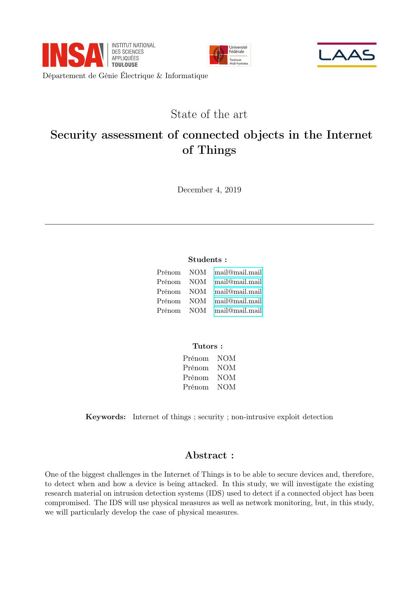
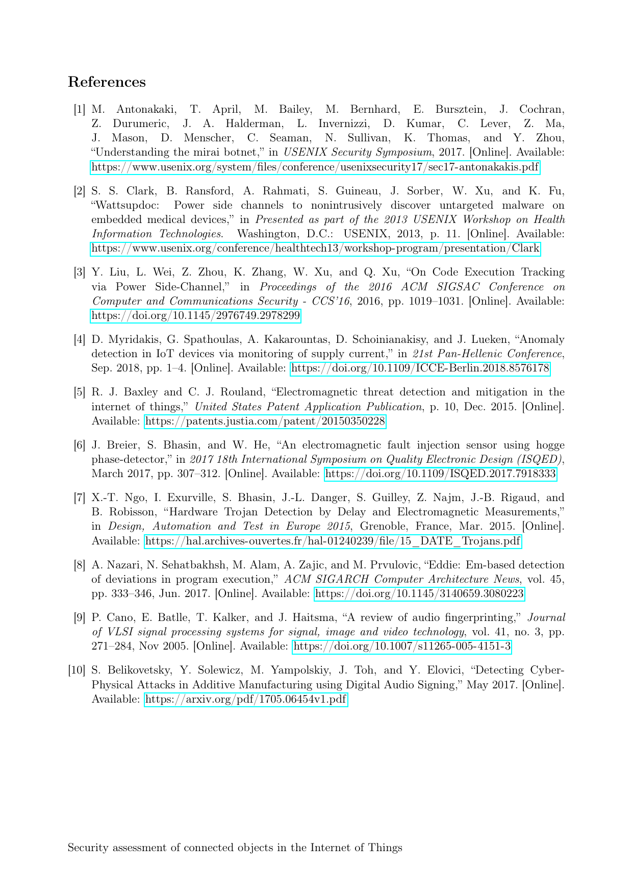

# [4A] Etat de l'art associé au projet d'initiation à la recherche

Template du document de l'état de l'art du projet d'initiation à la recherche de l'INSA de Toulouse

Vous pouvez cloner ce projet directement sur [Overleaf](https://www.overleaf.com) à cette adresse : 

[https://www.overleaf.com/latex/templates/insa-toulouse-4a-pir-state-of-the-art/ccqpsxwgbdfh](https://www.overleaf.com/latex/templates/insa-toulouse-4a-pir-state-of-the-art/ccqpsxwgbdfh)

| First page | Last page |
|-|-|
|  |  |
